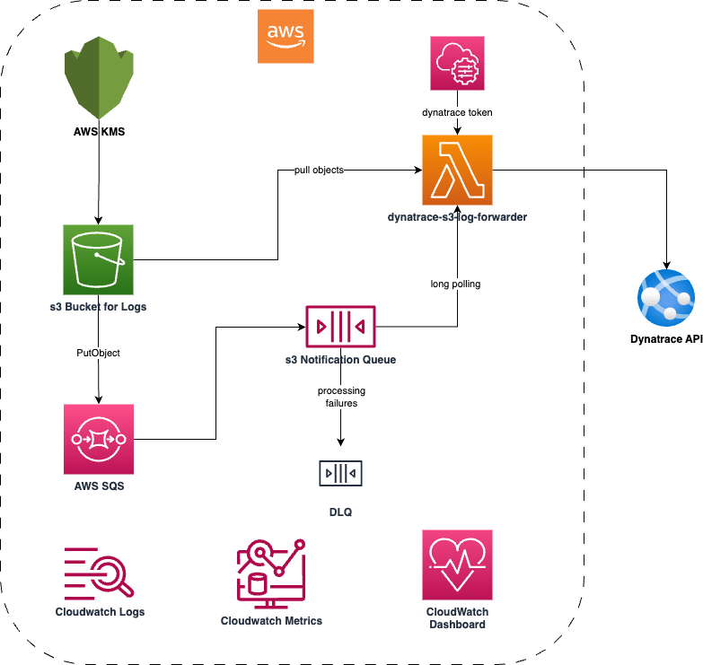
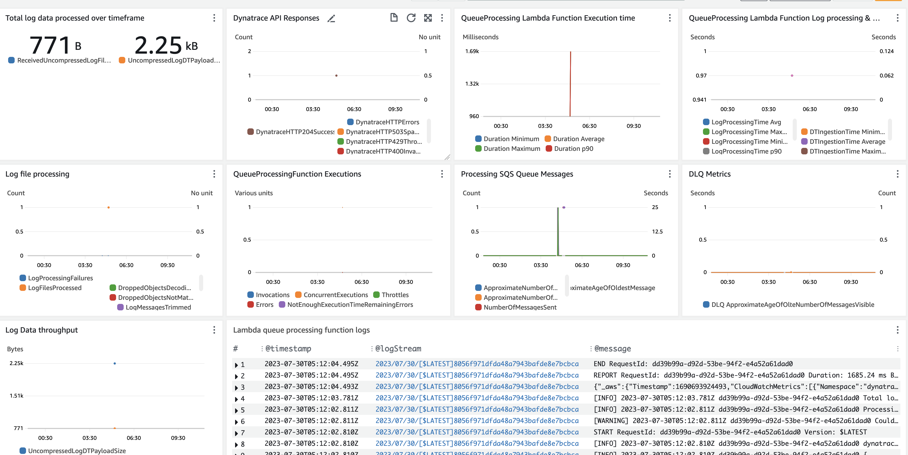

# dynatrace-aws-s3-log-forwarder

This project deploys a Serverless architecture to create an Amazon s3 bucket, and forward logs from Amazon S3 to Dynatrace. This is specifically compliant with BT DCP cloud.

## Architecture



## Supported AWS Services

The `dynatrace-aws-s3-log-forwarder` supports out-of-the-box parsing and forwarding of logs for the following AWS Services:

* AWS Elastic Load Balancing access logs ([ALB](https://docs.aws.amazon.com/elasticloadbalancing/latest/application/load-balancer-access-logs.html), [NLB](https://docs.aws.amazon.com/elasticloadbalancing/latest/network/load-balancer-access-logs.html) and [Classic ELB](https://docs.aws.amazon.com/elasticloadbalancing/latest/classic/access-log-collection.html))
* [Amazon CloudFront](https://docs.aws.amazon.com/AmazonCloudFront/latest/DeveloperGuide/AccessLogs.html) access logs
* [AWS CloudTrail](https://docs.aws.amazon.com/awscloudtrail/latest/userguide/cloudtrail-log-file-examples.html) logs
* [AWS Global Accelerator](https://docs.aws.amazon.com/global-accelerator/latest/dg/monitoring-global-accelerator.flow-logs.html) Flow logs
* [Amazon Managed Streaming for Kafka](https://docs.aws.amazon.com/msk/latest/developerguide/msk-logging.html) logs
* [AWS Network Firewall](https://docs.aws.amazon.com/network-firewall/latest/developerguide/logging-s3.html) alert and flow logs
* [Amazon Redshift](https://docs.aws.amazon.com/redshift/latest/mgmt/db-auditing.html#db-auditing-manage-log-files) audit logs
* [Amazon S3 access logs](https://docs.aws.amazon.com/AmazonS3/latest/userguide/ServerLogs.html)
* [Amazon VPC DNS query logs](https://docs.aws.amazon.com/Route53/latest/DeveloperGuide/resolver-query-logs.html)
* [Amazon VPC Flow logs](https://docs.aws.amazon.com/vpc/latest/userguide/flow-logs-s3.html) (default logs)
* [AWS WAF](https://docs.aws.amazon.com/waf/latest/developerguide/logging-s3.html) logs
* Custom Logs

Additionally, you can ingest any generic text and JSON logs.

## Deployment instructions

### Prerequisites

1. AWS Account
2. admin IAM Role
3. AWS ECR FUll Access Role
4. AWS CLI

### Deploy the utility

1. Clone the GitHub repository
```bash
git clone https://github.com/neelakurunji/dynatrace-aws-s3-log-forwarder.git
```

2. Change the bucket name to your desired value in the below two files - 
- config/log-forwarding-rules.yaml
- config/log-processing-rules.yaml

3. Build the docker image
```bash
docker build . --build-arg="ARCH=X86_64" --build-arg="ENABLE_LAMBDA_INSIGHTS=false" --build-arg="LAMBDA_BASE_IMAGE_TAG=3.9.2023.06.28.13" --tag=dynatrace-aws-s3-log-forwarder:latest
```

4. Export the following variables
```bash
export STACK_NAME=<Your Stack Name>
```
```bash
export DYNATRACE_TENANT_UUID=<Dynatrace tenant ID e.g. ssh69777>
```
```bash
export PARAMETER_NAME="/dynatrace/s3-log-forwarder/$STACK_NAME/$DYNATRACE_TENANT_UUID/api-key"
```
```bash
export HISTCONTROL=ignorespace
```
```bash
export PARAMETER_VALUE=<Your Dynatrace Token>
```
```bash
aws ssm put-parameter --name $PARAMETER_NAME --type SecureString --value $PARAMETER_VALUE -—overwrite
```

5. Create an AWS ECR repository
```bash
aws ecr create-repository --repository-name dynatrace-aws-s3-log-forwarder
```

6. Fetch the repository URI
```bash
export REPOSITORY_URI=$(aws ecr describe-repositories --repository-names dynatrace-aws-s3-log-forwarder --query 'repositories[0].repositoryUri' --output text)
```

7. Tag the Docker image
```bash
docker tag dynatrace-aws-s3-log-forwarder:latest ${REPOSITORY_URI}:latest
```

8. Login to AWS ECR registry
```bash
aws ecr get-login-password --region eu-west-2 | docker login --username AWS --password-stdin $(echo "$REPOSITORY_URI" | cut -d'/' -f1)
```

9. Push the Docker image to the ECR registry
```bash
docker push ${REPOSITORY_URI}:latest
```

10. Deploy the cloudformation template
```bash
aws cloudformation deploy --stack-name ${STACK_NAME} --parameter-overrides \
            DynatraceEnvironment1URL="https://$DYNATRACE_TENANT_UUID.live.dynatrace.com" \
            DynatraceEnvironment1ApiKeyParameter=$PARAMETER_NAME \
            ContainerImageUri=${REPOSITORY_URI}:latest \
            SourceBucketName=<Your Bucket Name> \
            LogExpirationDays=<Number of days to delete logs> \
            KmsKey=<KMS Key ARN> \
            --template-file template.yaml --capabilities CAPABILITY_IAM
```

11. Check the status of the cloudformation template for progress in a different CLI window
```bash
aws cloudformation describe-stack-events --stack-name $STACK_NAME
```

### Next steps

You can test by uploading a sample log file, and confirm the logs visible in the Dynatrace Logs and Events UI. The DQL query to verify the same is as follows - 
```
fetch logs //, scanLimitGBytes: 500, samplingRatio: 1000
| filter log.source.aws.s3.bucket.name == "<Your Bucket Name>"
```

### CloudWatch

The metrics and the usage stats for the utility will be made available in CloudWatch. A health dashboard will be also created dispalying all the important metrics.

The dashboard name will be - Your Stack Name-monitoring-dashboard. A sample screen of the dashboard is shown below - 




## Support
For any bug fixes, improvements, enhancements, or issues; Please reach out to Consumer CIO SRE Innovation team, or Write to venkatesh.dharmapuri@bt.com
